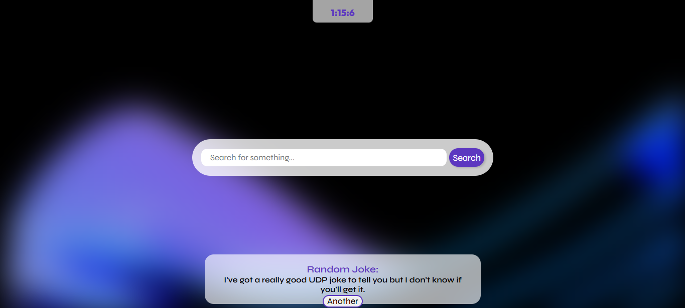
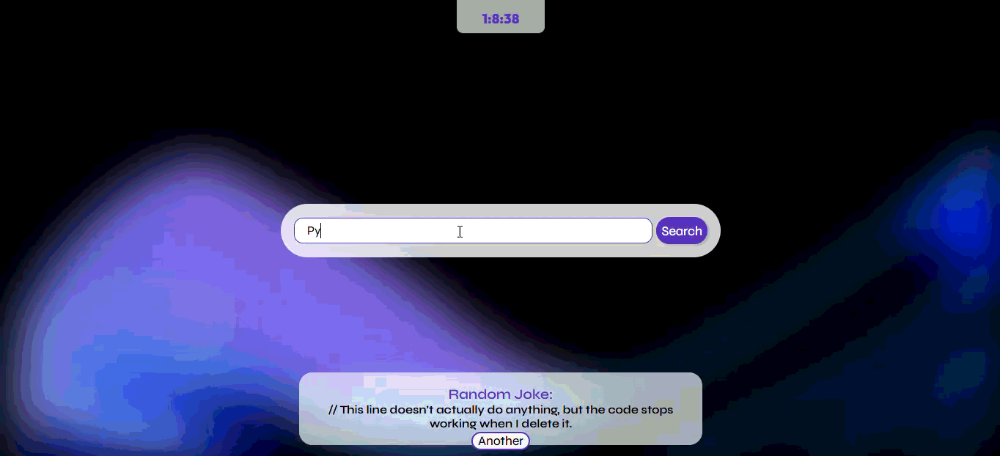

# New Tab

A simple new tab you can have in your broswer, with a search bar, time, and even random jokes

## More details about this project

All the jokes come from an API with the link: `https://v2.jokeapi.dev/joke/Any?blacklistFlags=nsfw,religious,political,racist,sexist,explicit&type=single`

When you click to search, the site will take you to a Google search page showing what you searched for, like this:

The main colors of this project are:
- Purple: `#5c37c0`
- Translucid with / Glass `#ffffffa4`
I tried making a clean and simple UI.

And Also, All the fonts you see in this project, are called `Syne` and `Outfit`, importen by Google fonts: `https://fonts.google.com/`

## Features
- Time
- Search Bar
- Random Jokes

You can try it [Here](https://brundevcoder.github.io/tab/)